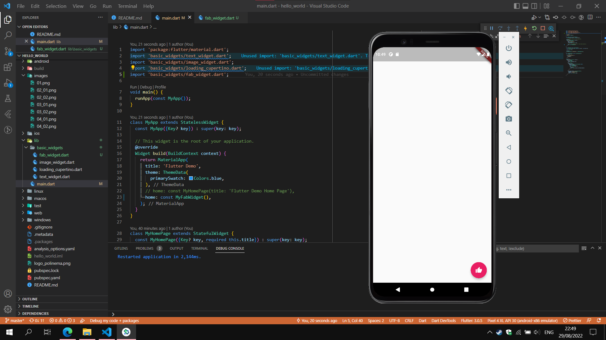

# hello_world

A new Flutter project.

## Praktikum 2

## Praktikum 3

- Text Widget

  - 
  - 

- Image Widget
  - 
  - 

## Praktikum 4

- Cupertino Button dan Loading Bar
  - 
  - 
- Floating Action Button (FAB)
  - 
  - 
- Scaffold Widget
- Dialog Widget
- Input dan Selection Widget
- Date and Time Pickers
