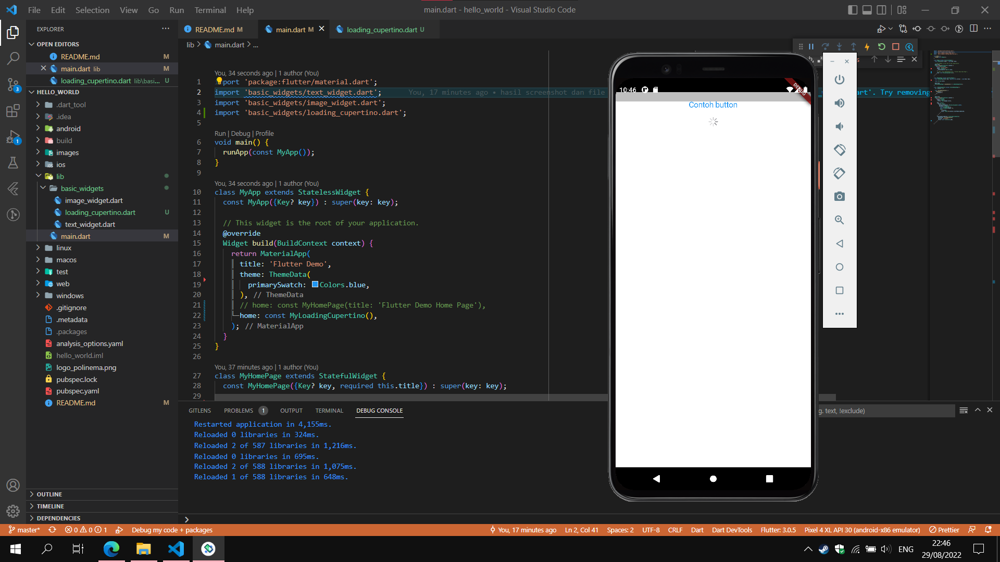
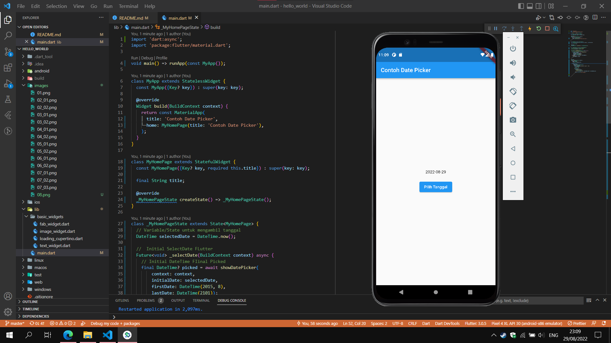

# hello_world

A new Flutter project.

## Praktikum 2

Menjalankan program flutter untuk pertama kali. Program yang dijalankan merupakan sebuah counter yang dapat berubah ketika menerima masukan dari pengguna ketika klik tombol +.

## Praktikum 3

- Text Widget

  - 
  - 

Widget Text digunakan untuk menampilkan teks ke dalam UI.

- Image Widget
  - 
  - 

Widget image terdiri dari banyak jenis seperti Network Image, Asset Image, Memory Image dan widget image lain yang didukung. Widget yang digunakan pada praktikum merupakan Asset Image yang akan menampilkan gambar dari aset yang sudah ditentukan oleh pengembang dan telah di daftarkan di file pubspec.yaml

## Praktikum 4

- Cupertino Button dan Loading Bar

  - 
  - 

Flutter menyediakan tema Material dan Cupertino. Material biasa digunakan di aplikasi Android, sedangkan Cupertino merupakan tema bawaan dari IoS. Kita bisa menentukan apakah menggunakan salah satu dari kedua tema tersebut.

- Floating Action Button (FAB)

  - 
  - 

Widget FAB merupakan salah satu dari widget button yang mengambang di aplikasi. Maksud dari tombol yang mengambang adalah ketika pengguna aplikasi melakukan scrolling, tombol FAB tetap berada di posisi tersebut.

- Scaffold Widget

  - 
  - 

Widget Scaffold merupakan widget utama untuk sebuah halaman di Flutter. Di widget ini memiliki beberapa parameter sepetri AppBar untuk membuat bar aplikasi, body yang berisi konten utama dari aplikasi, floating action button, bottom navigation dan lain sebagainya.

- Dialog Widget

  - 
  - 
  - 

Widget dialog merupakan widget yang menampilkan pesan mengambang di aplikasi. Widget dialog terdiri dari judul (title), konten (content), dan sekumpulan aksi (action) yang bisa ditambahkan pengembang untuk mendapat masukan dari pengguna.

- Input dan Selection Widget

  - 

Widget TextField yang ditampilkan di praktikum merupakan salah satu widget yang menerima masukan dari pengguna berupa teks. Widget TextField memiliki beberapa parameter seperti obscuretext yang digunakan untuk mengamankan masukan agar disamarkan, onChanged untuk memproses perubahan yang dilakukan pengguna, decoration untuk mengubah tampilan dari TextField dan lain sebagainya.

Widget lain dalam kategori ini antara lain Checkbox, Date and Time Pickers, Radio Button, Slider, Switch.

- Date and Time Pickers

  - 
  - 

Date and Time Pickers merupakan salah satu dari kategori input dan selection. Mengizinkan pengguna untuk memilih tanggal bulan dan tahun. Ketika membuat date time picker membutuhkan sebuah method yang akan mengolah method showDatePicker dimana method ini akan menampilkan jendela mengambang berisi kalender yang bisa dipilih oleh pengguna.
Jika tanggal selesai dipilih, maka nilai tersebut akan diperbarui ke dalam state agar nilai dari tanggal saat ini berubah ke tanggal yang dipilih.
